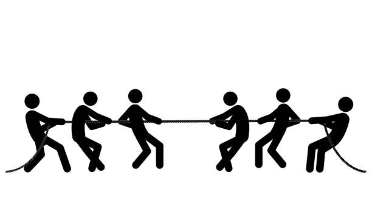

## First Impressions
When I first started working with Bootstrap 5, it was overwhelming to say the least (like most things I learn in this class). Figuring out all the syntax like rows, columns, containers, classes, it all seemed so foreign and like extra work on top of what I could already do with regular HTML and CSS. Though I wasn't quite at that point skillwise in basic HTML and CSS anyways, I thought to myself, why couldn't I make my own layouts and buttons if I really wanted to? What would be stopping me? Well, nothing really, but when you're constantly in a race against the clock, you simply don't have enough time to be fiddiling around!

After building a few pages, bit by bit, through our practice in-class WODs, WOD experiences, and actual WODs, I am definitely starting to see the importance of frameworks like Bootstrap, and what makes it so powerful. It's more than a tool for styling, it enables structure, faster implementation, and scalability. Bootstrap provides a consistent, responsive (necessary for playing around with resizing pages/smaller screens) foundation that lets you focus more on the design elements and contents rather than starting from scratch, every time. I want to say that I understand every little intricacy there is to know about Bootstrap, but I don't. Despite that, I believe strongly that once it becomes second nature, being able to align, center, and resize elements will become a habit for me.

For example, when I first built the various shop pages for our WOD experiences, a lot of these Bootstrap concepts were new. But when we started working on recreating restaurant websites, parts started clicking. Then when we had a choice to recreate a website of our choice, I found that recycling a lot of the Bootstrap snippets from my prior repositories was really useful. It was like going from handwriting every single note for a math class, having to draw all of the graphs and stuff by hand, line by line, to digitally typing your notes, highlighting words and inserting images with only a few clicks. And I definitely don't want to be writing lines upon lines of CSS rules either.
 

  <figure style="display:inline-block; text-align:center; margin:10px;">
     
    <figcaption>(HHHRC's original webpage)</figcaption>
  </figure>
  <figure style="display:inline-block; text-align:center; margin:10px;">
     
    <figcaption>(My recreation)</figcaption>
  </figure>

Here I recreated the HHHRC's homepage without inspecting the CSS elements. It was really fun trying to make a one-to-one recreation of the site, even if not fully-functional

## For the Future
The frustration with Bootstrap comes and goes. Even while using it, it may make setting things up easier, but trying to override the default Bootstrap settings can prove tricky if you're not entirely sure what to implement (my experience). The rules can feel restrictive, especially at times when you have specific images in your mind and full creative control. At first, I was constantly wrestling with its default styles, trying to make buttons look less "Bootstrap-y", margins not lining up how I expected (despite having clear margin implementations in-place), and color palettes that would clash (sometimes I think that my work is broken when really the text is just the same color as the background). Even now, it requires a lot of patience to customize with custom CSS, making every page look how I want it to. 
 
 

The learning curve seems steep, but I can see the payoff. I see it akin to TypeScript, which aids in avoiding type errors as you're programming, Bootstrap helps by avoiding design chaos. It allows for consistent spacing, typography, and responsive behavior that you can always rely on instead of having to reinvent it each time. UI frameworks teach design discipline. It teaches me to think in terms of components, such as the navbar, footer, header, etc. Pieces that can be reused and combined. 

Bootstrap to me is more than just simple layouts and templates you copy and paste. I think a lot of the fun of it is what you do with that foundation. Bootstrap provides the tools to amplify your creativity. UI frameworks brings consistency to your design. It's like learning how to think like a designer and a developer simultaneously.
