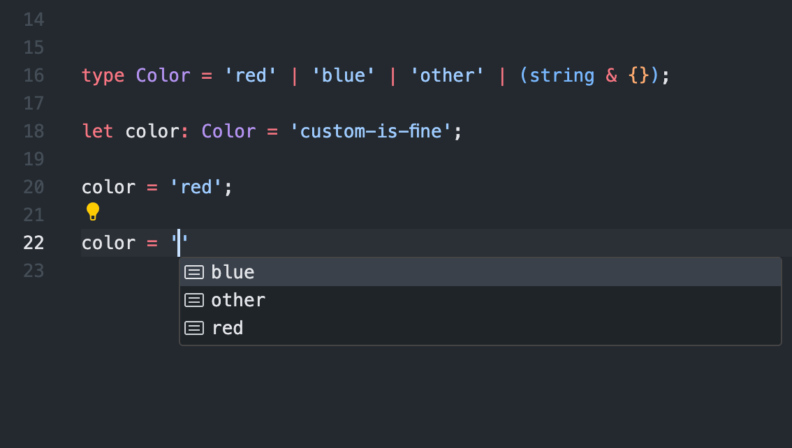

## TypeScript...hmm... 
Learning TypeScript has definitely been a challenge to say the least. A lot of it feels familiar in a way but also very different at the same time. For example, the static typing versus dynamic typing of *JavaScript*. It's something that was mentioned during our lectures and pointed out as a defining feature of the language and in our WODs or in-class practices, I definitely notice that functionality. Being able to see errors like mismatched type as I'm writing lines of code is huge benefit as it lets me check and fix them as they're being written. Whereas in other programming languages the errors may only occur during runtime. Before taking this course, I had never heard of TypeScript but it seems quite similar to Java for me. For example, the object-oriented programming and the syntax used in the language such as use of curly bracketes, phrasing of conditional statements such like if, else and loop statements are also quite similar. 
 

It's interesting looking at TypeScript because it's a superset of JavaScript. Though I have had experience using JavaScript in the past, I'm definitely a bit rusty when it comes to my knowledge of it. TypeScript has not been a walk in the park, far from it. Java has been the main coding language that I have been practicing because of my classes up until now, so the switch is still pretty foreign. This module, specifically ES6 was definitely a nice refresher for a lot of JavaScript concepts that I had forgetten, as well as taught me a lot of new ones. A nice feature to also mention about TypeScript is that it seems to have an autofilling tool. It's quite convenient and makes writing longer code more efficient as it checks what you're writing and, similar to a search engine's autofill, will prompt the next bit of code for you to use.  Thinking about it all, TypeScript for me will continue to prove an uphill battle, but it's one that I know will be worth it. The code that we have been writing for our TypeScript assignments has been eye-opening. Even though the WODs so far have been smaller-scale projects, as TypeScript utilizes explicit type declarations, code completion, and static typing, it will definitely be useful for working on larger-scale projects and especially with teams. That's why I believe TypeScript would be a great programming language for Software Engineers. 

## So slow... so so slow.
The concept of athletic software engineering is very daunting to me. I can understand the real-world application and importance of practicing/learning in this manner, as it builds one's capabilities of coding under pressure, however, it's still very stressful! These WODs for me have been like mini-midterm exams. In the sense that only during my exams in prior ICS classes have I been put on the spot to code within a specified amount of time. It's something that definitely haunts me to a slight degree as student (haha). It's not all bad though, I've definitely been warming up to them and I can actually feel like the practice is paying off. At the moment, I'm still very slow when coding and these WODs have drawn much-needed attention to that.

By having practice WODs at the beginning of the week, I become familiarized with the type of functions and program I know we'll likely be receiving on the actual WOD later in the week. During the brief time, I try to perfect and understand my code so that come time for the actual WOD, I'm more prepared and able to handle the pressure of a digital timer (still working on achieving better times). In some aspects, they're pretty fun and satisfying. There's some form of gratification there in knowing you were able to finish your working code (and test-cases) on time or even close to on time. Though the code can often be messy from the need to finish it in a hurry, that's what makes it engaging. I'm constantly on my toes scrambling to fix things as I'm writing them (static typing yay) and also trying to keep up with that timer in my head. As I work on more WODs I think I will grow to appreciate and benefit a lot from this style of learning.

*"Nobody cares if you can't dance well. Just get up and dance." - Martha Graham*
    
