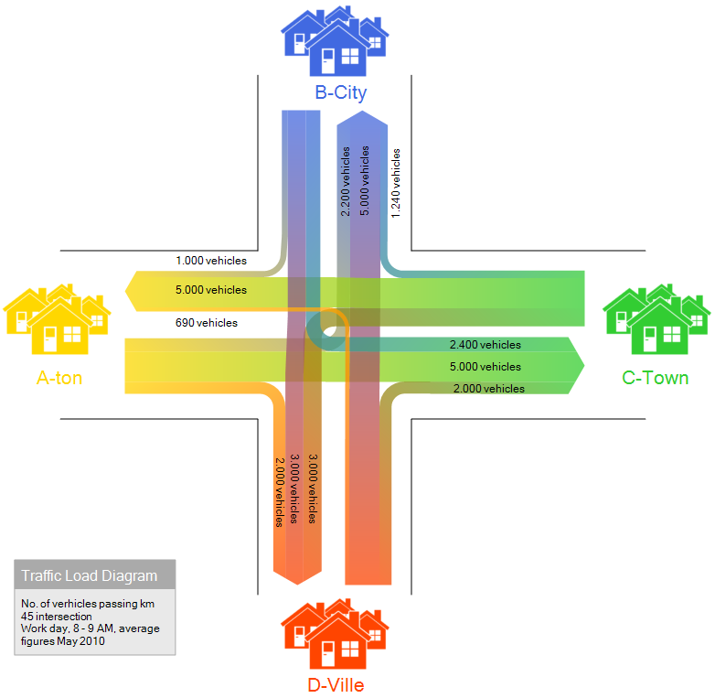

## The First Encounter
Hearing the word phrase _design patterns_, my first few thoughts were along the lines of something CSS-related like layout ideas or UI templates. Then I kind of realized that they're instead like urban planning rules that make up a city. Not like the tall fancy skyscrapers you'll see in the skylines but instead the stuff happening hidden from view like zoning maps, road systems, and traffic flow decisions that allow everything within the city to function without chaos. Like cities, software grows fast. At first, you might build a few buildings (like your API routes), and it all seems manageable, but as you build and build; as more features appear, the "streets" between the buildings begin to tangle. Without planning, you could end up with a coding project that's a total mess. And I'm going to admit that for most of my coding lifetime, I had that mindset. The build whatever I needed and wherever it could fit, hoping nothing would crash. It wasn't until we began our work on final projects that I realized how important design patterns were in how they provided structure.

## Recognizing the Patterns in Our Project
Our project naturally fell into a loose system with some semblance structure, like an **MVC System**. Prisma was our **Model**, the organized grid of data. Our UI lived in the **View**, the public-facing part of the "city". And our API routes quietly acted as **Controllers**, directing traffic so everything flowed smoothly between the two. We didn't explicitly label any of this, but the structure WAS there, just like how most cities follow order and patterns, even when the residents within don't pay much mind to how this order is instilled.

React added its own layer of "city planning" . Its automatic rerenders worked like an **Observer pattern**, where areas of the city (components) update themselves whenever something in their district changes (state). We didn't implement this ourselves, as it's baked into the framework, but we relied on it constantly. And whenever we wrote helper functions to create new data with consistent defaults, we were unknowingly using a **Factory-like** pattern, creating standardized "construction plans" for our new buildings.

These were all invisible frameworks that quietly shaped how our project grew.

 

## Why it Matters
What I've come to appreciate is that design patterns give us a shared understanding of _how_ software should expand, the same way city planners share principles for designable livable spaces. They stop us from creating dead ends, duplicated infrastructure, or confusing pathways that only make sense in the moment we typed them. I realized that I wasn't learning new concepts but instead, throughout the constant process of this project, I started recognizing the structures I had been using throughout the semester. Design patterns are not restrictive rules. They're guidelines.

They make sure that our software "city" expands, it remains functional, maintainable, and maybe even a little beautiful behind the scenes.

 
