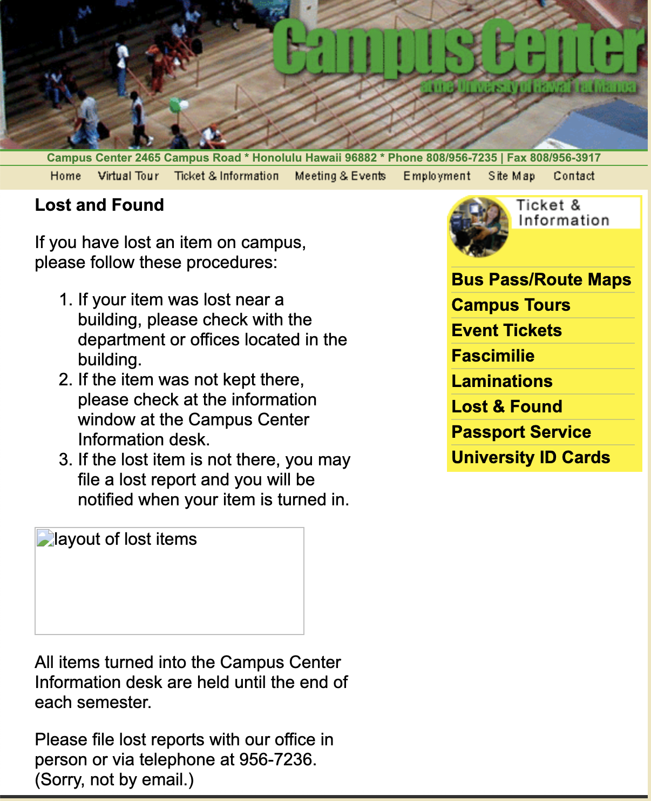

<figure style="float: right; margin-left: 20px; margin-bottom: 10px; text-align: center;">
  
  <figcaption><em>(UH Manoa's Current Lost and Found Page)</em></figcaption>
</figure>

Proposers: Jermaine Bruno, Michael Lau, Brandon Nguyen, Edward Uzueta
## Overview
The Problem: Throughout the semester, students at UH Manoa may lose countless items such as IDs, water bottles, textbooks, or even valuables such as their AirPods or other electronic devices. UH Manoa does have a Lost & Found system, but the current process consists of manually emailing departments, visiting physical locations like Campus Center, and making phone calls to said offices. It can be very inconsistent and students have no way of knowing when or if their items have been found without repeating this process numerous times.
 
 
The Solution: **Manoa Lost & Found** would be a **digital platform for posting, searching, and aiding in the recovery of lost items** on the UH campus. Users will be able to create posts for their lost items, adding images, tagging potential lost-at-locations, as well as leaving their contact information. For users that have found lost items, they will also be able to create posts for items that they have found, including images, and will be prompted to return the item to official UH offices such as Campus Center. It connects finders and owners directly by UH authentication, organized item listings, dramatically improving lost-item recovery efficiency.
 
## Approach
For this app, we will create a campus-wide, unified way to **report, browse, and recover** lost items at UH Manoa. There are three roles: **Users** (students/staff) who can log in to report items they have lost and search/browse through found items; **Finders** (any logged-in user who posts a found item) who can create "found" listings and are guided to turn items in to offical UH collection points; and **Admins** (Campus Center/Library or designated staff) who can verify items, manage flags/duplicates, and mark items as **recovered**.

The Manoa Lost and Found app will provide an easy-to-use directory of lost and found items reported across campus. In addition to organizing listings by **status** (Lost vs. Found) and **category** (Electronics, IDs, Books, Clothing, Misc), you can also organize and filter data by **location** (last seen/turned in), **date**, and **keywords** to speed matching.

Users should be able to:
- Create **Lost Item** reports with photo, category, description, last-seen time/place, and optional distinguishing details
- Set **alerts/preferences** (e.g., keywords like "Hydroflask," categories, or buildings) so they can be shown a feed of suggested matching **Found** posts when they appear
- View a personalized dashboard with "My Lost Items," "My Found Items," and **Matches and Alerts**

Finders should be able to:
- Create **Found Item** posts with photo, where/when it was found, and where it was **turned in**
- See a **"How to turn in items"** page with instructions for offical UH offices (e.g., Campus Center, Library)
- If they spot a matching **Lost** post, they can send a notification to the owner **without arrranging private handoffs** (owner retrieves the item from the offical office)

Admins should be able to:
- **Verify** items turned in at offical locations and update the status of items (e.g., _Recieved at Campus Center, Ready for Pickup, Recovered_)
- **Flag** duplicate posts, moderate content, and manage role assignments
- Configure campus **drop-off** locations with hours and contact info

To encourage safe recovery and deter theft, **all physical returns should flow through offical UH offices**. Messaging exists only to confirm a likely match and inform the owner **where** the item was turned in.

## Mockup page ideas
- Landing page
- Feed (tabs for Lost and Found, quick filters by category/location/date
- Dashboard (My Lost Items, My Found Items, Matches & Alerts)
- Post Lost Item
- Post Found Item
- Item Details page
- Recovery Instructions page
- Admin home page
- Locations & Offices page
- Search & Advanced Filters

## Use case ideas

