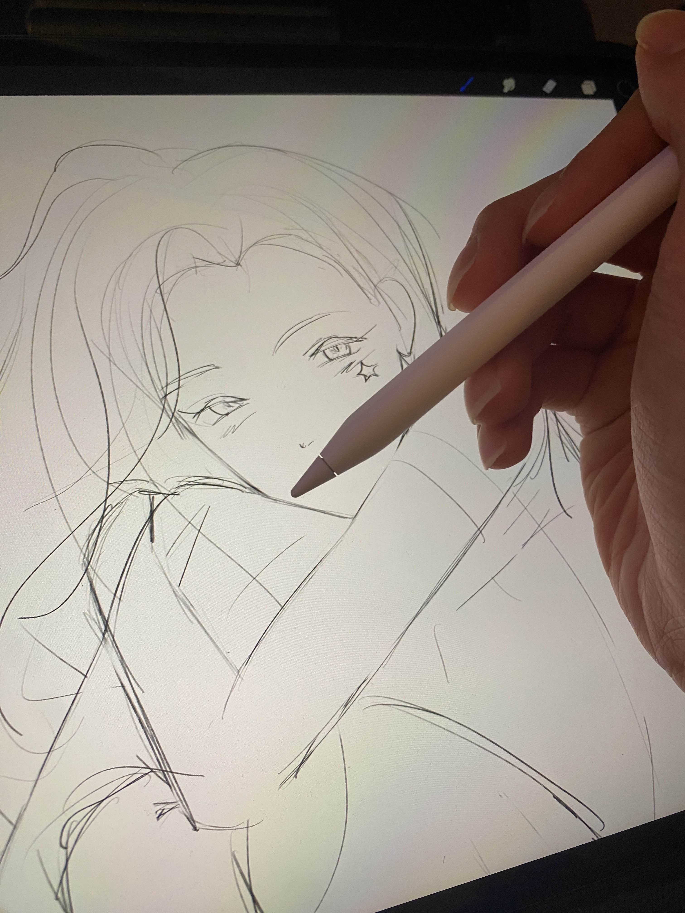

## Where It Started
Growing up, I never really had an interest in the academics. I never really thought memorizing trig. functions or the unit circle was fun, despite being in math club. I never really figured out how to solve RICE tables, despite passing AP Chemistry. And I never really thought people were all that interesting despite having spent 250+ hours every year volunteering at community events. All of these things I did growing up in school I did because I guess it was what was expected of me. I didn't excel at these things that I did but I didn't fail at them either. Life had grown complacent. In the background stirring though, between the math leagues, between the chemistry study sessions, and between the timesheets, I played video games. Ever since I was a child, when I received a *Nintendo Game Boy Advance* for my 5th birthday, I was drawn to the light on the screen. Every minute and second away from school I was at home on a Desktop, on a video game console, or watching older relatives play games. Though I saw it as a hobby, playing video games to me felt very different from understanding and making them.

I drew a lot growing up and I still draw a lot now. I took piano lessons from elementary up until college. And I played so, so, so much video games. But, I never considered myself a creative. Nor did I see the creatives as a viable career choice. In households like mine, you're always told that being a doctor, lawyer, and engineer are the only paths to success; as only money can buys one's happiness. So I studied. I studied until I couldn't. It's because of this ideology, this feeling that I had no other choice, that I was initially pursuing a Biochemistry degree for my first couple years in college. Little did I know that the choice that was supposed to guarantee me happiness only brought me so much remorse and misery over the path my life was taking. I stopped feeling like my own person.

It was the night before my Organic Chemistry midterm, sophomore year of college, and as I watched the digital clock in the corner of my laptop turn to 3AM, I knew this wasn't what I wanted to do anymore. In the next moment, I hovered my mouse over the *Minecraft* application sitting on my desktop, and I opened it. Games were a comfort and an escape and for the rest of the night, I couldn't sleep; I was playing until the sun started creeping past my blinds. In those late hours, I reminisced of a time in middle school where I had been obsessed with *Minecraft*. I was so fixated on this game at the time, I would come home from middle school watching tutorials on how to create mods for the game using *Javascript* and *Eclipse*. So for the next two weeks, I did just that, eventually making my own fully functional mod!

## Now what?
Today, I still draw, I still play the piano, and I still love to play video games. However, now I see these as potential avenues for where I want to take my career. I have the courage and the desire to call myself a creative and I want to continue working towards improving and honing my craft. Despite having made that mod for a game I loved back in middle school, I always brushed it off as a little hyperfixation I had at the time. It hadn't occurred to me at the age of 11 that I was coding for the first time in my life. I made the switch to Computer Science after my second year of college. A gap year and a few semesters later, now I'm here, taking my first software engineering course. All of the ICS courses I have taken so far are constant reminders of how much there is to learn and quite frankly, every lecture, assignment, and exam is a humbling experience.

### Why software engineering matters
Being able to create fully functioning programs from scratch. It's like magic to me. I'm always in awe of how truly complex a lot of the daily applications we use are. It's overwhelming to even try and think about. When I look at the video games I play, I used to just see moving pixels on a screen and buttons that light up when pressed. Now, I see that for every one thing I see, there are lines of code held together by other lines of code, making the whole thing seamless and functional. Outside of games as well, even apps such as our calendars, reminders, and communication apps, are all held together by numbers and letters. I want to become a software engineer that is capable of doing just that. Creating something from nothing. I want to create programs that are useful and will benefit my life as well as others. In the future, I hope to gain experiences in game development. It's definitely a personal goal to create a game of my own that combines my interests in art, writing, music, and technology. I hope that by learning more about software engineering, I gain skills required in the field, such as working on large-scale projects with a team. Or perhaps, I'll just do it myself!
