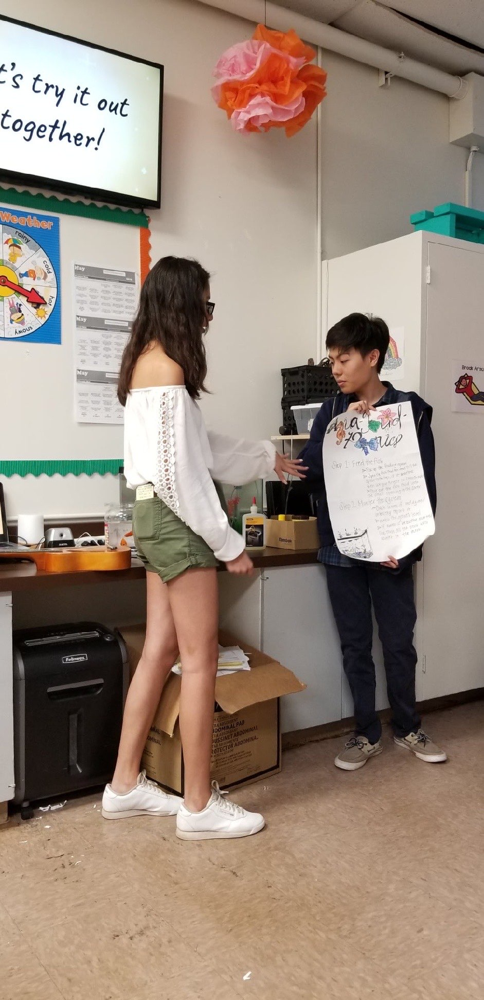
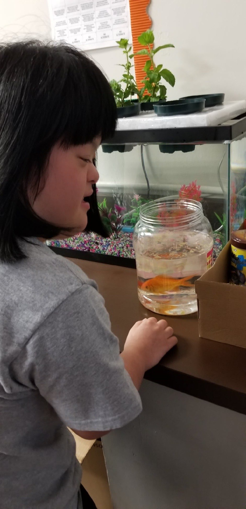

In my high school's *Best Buddies International* club (a non-profit organization that aims to enhance the lives of those with intellectual and developmental disabilities), me and my friend were tasked to create a project that would actively involve our fellow students as well as teach them lessons of responsibility. Our initial thought would be a classroom pet such as fish or hamsters. However, we wanted to do something that was a little more interesting while also lessening the required load of maintenence as pets (even fish) can be quite a long-term investment in terms of time and expenses. We arrived to the concept of aquaponics, a system that combined hydroponics (growth of plants in water) and aquaculture (raising fish). This theoretically creates a symbiotic relationship between the fish and plants. Ammonia in the fish's waste is asborbed by the plant's roots through the water providing nutrients for their growth.

This type of approach would allows us to create a project that actively involved the students by providing them with simple tasks such as feeding the fish, monitoring their growth, as well as monitoring fish/plant health. The use of aquaponics ideally would lessen the time and need for frequent maintenence on the fish tank like cleaning excessive waste as ammonia was being consumed by the plants and beneficial bacteria within the system. Plants would also thrive from the extra nutrients that their roots would absorb. We also made the intentional choice of growing garden herbs like basil and chives while also including some flower seeds such as lavender. These were plants that we felt the students could find many uses for once grown. In practice, the system would provide herbs and flowers for the students throughout the school year.

This project taught me a lot about the process of drafting up ideas, going through trial-and-error, budgeting, receiving feedback, and implementing our ideas. It was a project that was done over the course of a month and we finished with a presenation on it to our club.

Here are some photos from that day:
 
 

