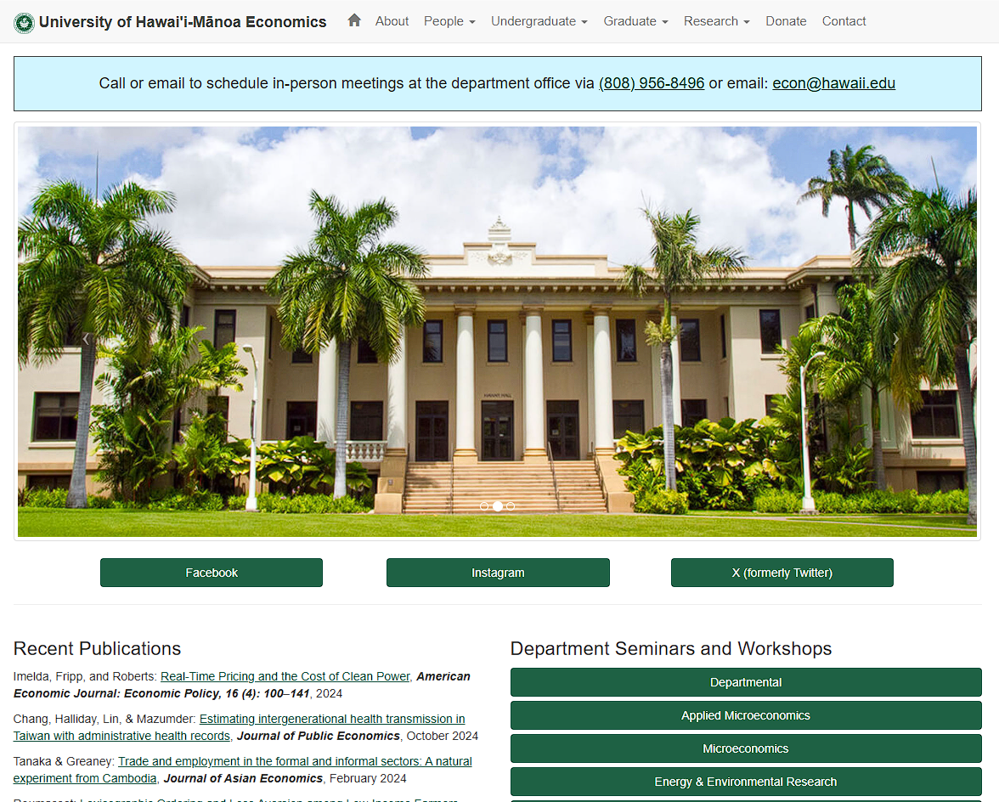

  

Being the Web Tech Support for the Economic department at UH Manoa is a job that requires working knowledge and experience of the markup language, HTML and the style sheet language, CSS. Use of both of these languages allows for the creation and formatting of the website while SFTP protocols are used to upload files onto the ITS web server's directories. 

This is a position that the Economics department only started hiring for in recent years in an effort to create a unique and distinct site where all important information is readily available for its users to access. As the only individual hired for this position, I took it upon myself to review all already established code and files located in the site's directiories that allow functionality. This required going through all of the HTML pages manually and reading through every line of code to understand what it is doing and how it works on the live site (also understanding how to utilize programs that allow for SFTP programs such as FileZilla). I felt this was a necessary step in order to allow myself time to familiarize as well as prepare for future projects. A large part of my job is also updating and uploading new files onto the site to publish these changes. It isn't unusual to sometimes notice formatting bugs afterwards that will require troubleshooting. 

While many of the changes for the I will make to the existing code are minimal and straightforward (the process of updating and tweaking numbers), occasionally I will be assigned larger projects that will require heavy amounts of editing to old sections of code, or creating entirely new sections. As I am editing and working on larger tasks, the site will remain active without any of the new changes unless they are published. This brought up an interesting dilemma for me as making any changes to the site that I were unsure of would still require me to upload for publishing. If the changes were never published, I would not be able to see how they would affect the live site. Thus, during the handling of projects that required more experimental changes, I had to find a balance of deloying changes that would minimize the downtime of the site looking otherwise intended.

Check out the Economics website [here](https://economics.hawaii.edu)!
